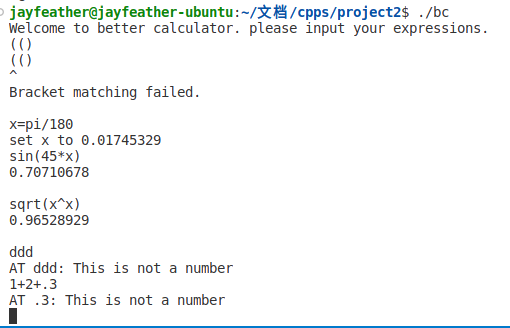

# CS205 C/ C++ Programming - Better Calculator

**Name**: 肖佳辰

**SID**: 12112012

## Part 1 - Analysis

The problem is to calculate a set of expressions, including basic operations, variables, math functions.

## Part 2 - Code

```cpp
//Too long to put here.
//See codes in ./src
```

## Part 3 - Result & Verification

Test case #1: Support of math functions

```
input: ln(e)
output: 1.00000000
```

Test case #2: Support of variables

```
input: x=sin(45*pi/180)
       x
output: 0.70710678
```

Test case #3: functions, variables, basic operations.

```
input: x=sin(45*pi/180)
       y=sqrt(2)
       x*y
output: 1.00000000
```



## Part 4 - Difficulties & Solutions

Computers are not good for compute `infix expression`. So we convert the input to `suffix expression` to store and calculate the expression. Use `map` to store variables.
