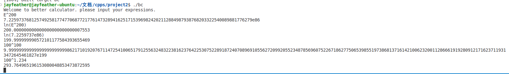

# Report has been updated. Add big number support. 

# CS205 C/ C++ Programming - Better Calculator

**Name**: 肖佳辰

**SID**: 12112012

## Part 1 - Analysis

The problem is to calculate a set of expressions, including basic operations, variables, math functions.

## Part 2 - Code

```cpp
//Too long to put here.
//See codes in ./src
```
`bignumber.cpp` for big numbers operation including basic operations, math functions (use Taylor Expand expression).

`variables.cpp` for store and use variables.

`calcRPN.cpp`   for calculate the input expressions.

`main.cpp`      for begin.


## Part 3 - Result & Verification

Test case #1: Support of math functions

```
input: ln(2)
output: 0.693147180559945309417232121471
```

Test case #2: Support of variables(Case-sensitive)

> PI and E are built in.

```
input: x=sin(45*PI/180)
       x
output: 0.707106781186547524400844362090
```

Test case #3: functions, variables, basic operations.

```
input: x=sin(45*pi/180)
       y=sqrt(2)
       x*y
output: 1.00000000
```

Test case #4: Big numbers

```
input: E^100
       ln(ans) //Here 'ans' means the last result.
output: 2.68811714181613544841262555652452874703459005492096966e43
        1.000000000000000000000000000018

input: 1000000000000000000000000000000000000000000000000.999999999999999 + 0.001
output: 1.0000000000000000000000000000000000000000000000010009999999e48
```




## Part 4 - Difficulties & Solutions

Computers are not good for compute `infix expression`. So we convert the input to `suffix expression` to store and calculate the expression. Use `map` to store variables. Write `big_number` to store very big numbers (up to 10^500)

But to calculate Taylor Expand may lose precision and due to performance we cannot fix it.
